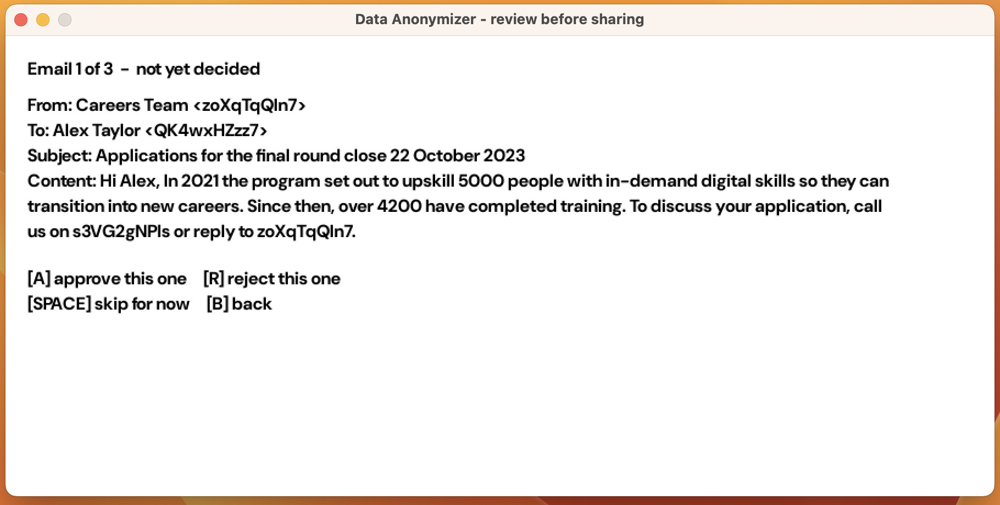
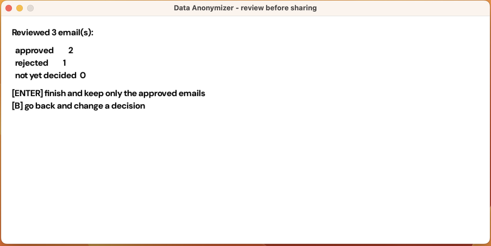

# anonymizer

Use an LLM on your real email without handing over its contents.

The tool strips identifying values out of your messages, so you can paste them
into ChatGPT safely — then puts the real values back into whatever it sends you.
The mapping between the two never leaves your machine.

```
  Gmail ──► data.json ──► [ anonymize ] ──► anonymized_data.json ──► review window
                                │                                          │
                                ▼                                          ▼
                          swapped.json                              paste into ChatGPT
                        (never shared)                                     │
                                │                                          ▼
                                └────────────► [ revert ] ◄────── finished_data.csv
                                                    │
                                                    ▼
                                             output_data.csv
```

Anonymising text is easy. Anonymising it *reversibly*, so the model's answer is
still useful to you, is the harder half — and that is what this builds.

---

## Try it in ten seconds

No Gmail account, no credentials, no setup beyond a compiler:

```sh
make        # build
make demo   # run the round trip on the bundled sample emails
```

Real output from `make demo`:

```
Read 3 entries from sample_data.json

Scanned 3 email(s) from sample_data.json.

Found and replaced 10 value(s):
  email addresses  5
  international    2
  phone numbers    2
  long numbers     1

Wrote anonymized_data.json  (safe to share)
Wrote swapped.json          (the mapping — keep this private)
```

An email goes in:

```
From:    Careers Team <careers@example.com>
Content: ... call us on +61 3 9000 1234 or reply to careers@example.com.
```

and comes out scrubbed, with the surrounding prose untouched:

```
From:    Careers Team <QWlv2en1AB>
Content: ... call us on ZfuxdJIdTg or reply to QWlv2en1AB.
```

Note that `2021`, `5000` and `22 October 2023` survive — only the contact
details are replaced. The same address always receives the same token, so the
model can still tell that two mentions refer to one person.

Feed the model's reply back through option 3 and the real values return, with
punctuation and formatting intact:

```
"Orders","Order #PO-012-40000000000000000 was confirmed; contact
 alex.taylor@example.org — phone +123456789 — for a AU$5 credit, within 48 hours."
```

---

## Requirements

To build and run the demo:

| Need | Why |
|---|---|
| [SplashKit](https://splashkit.io/installation/) (`skm`) | The review window |
| `clang++` with C++14 | The core program |
| `make` | Build |

To read your own Gmail, additionally:

| Need | Why |
|---|---|
| Python 3 | The Google client libraries are Python-only |
| `make deps` | Installs them into a local `.venv` |
| `secret.json` | Your Google OAuth client — see below |

`json.hpp` ([nlohmann/json](https://github.com/nlohmann/json)) is vendored in the
repository, so there is nothing else to install.

### Connecting Gmail

1. In the [Google Cloud Console](https://console.cloud.google.com/), create a
   project and enable the Gmail API.
2. Create an OAuth client ID of type **Desktop app**.
3. Download the JSON and save it beside the program as `secret.json`.
4. Run the program and choose option 2. A browser opens once for consent; the
   resulting token is cached in `token.json`.

The requested scope is `gmail.readonly`, so the tool cannot modify or delete
anything in your mailbox. `secret.json` and `token.json` are both gitignored.

---

## Using it

```
Menu:

  1. Anonymize the sample emails  (demo - no setup needed)
  2. Anonymize my Gmail           (needs secret.json)
  3. Restore an LLM reply         (needs finished_data.csv)
  4. Exit
```

The review window shows each scrubbed email so you can confirm by eye that
nothing sensitive is left before anything is sent:

Each email is judged individually:



Contact details have become tokens, while `2021`, `5000`, `4200` and
`22 October 2023` are left alone — the message still reads as a message, which is
what makes the model's answer worth having.

| Key | |
|---|---|
| `A` | Approve this email |
| `R` | Reject this email |
| `SPACE` | Skip — decide later |
| `B` | Back to the previous email |

At the end you get a tally, and `ENTER` finishes:



`anonymized_data.json` is then rewritten to contain **only** the approved emails:

```
Approved 2 of 3 email(s).
1 withheld — anonymized_data.json contains only the approved ones.
```

Per-email rather than one verdict for the batch, because with thirty emails you
may want to keep twenty-nine and drop one — a single decision would force you to
discard everything or share something you were unsure about.

This step is not decoration. The pattern matching cannot detect names, street
addresses or anything else without a recognisable shape, so a person is the last
check before data leaves the machine. Two deliberate choices follow from that:

- **Anything left undecided is withheld, not shared.** Close the window halfway
  and only what you explicitly approved survives. Silence is not consent.
- **Approve nothing and the file is deleted**, rather than left as an empty shell.

Once approved, paste `anonymized_data.json` into the model, save its reply as
`finished_data.csv`, and choose option 3 to restore your details.

`make check` scans the repository for anything resembling real personal data —
worth running before you commit.

---

## What it detects

| | Example |
|---|---|
| Email addresses | `alex.taylor@example.org` |
| International numbers | `+61 3 9000 1234` |
| Separated phone numbers | `1300 555 010`, `555-123-4567`, `0412 345 678` |
| Long numeric references | order and account numbers of seven digits or more |

## Known limitations

It does **not** detect names, street addresses, or anything else without a
recognisable shape — the matching is regex-based. That is why the review step
exists and why it is not optional. Message bodies also come from Gmail's
`snippet` field, which is a preview rather than the full text, and the LLM step
is manual: the tool does not talk to any model itself.

The full list, with the reasoning behind each, is in
[`ORIGINAL-2023.md`](ORIGINAL-2023.md).

---

## About this version

Built in 2023, and kept here as originally architected — C++ with a SplashKit
review window. This release repairs the defects in that build and adds a build
file, a demo path and documentation; the architecture is unchanged.

[`ORIGINAL-2023.md`](ORIGINAL-2023.md) is the design record: what it set out to
do, the decisions behind it, what had to be repaired, and what it still does not
cover.

## Development notes

The original program was written by me in 2023. The 2026 repair work — the defect
diagnosis and fixes, along with the build tooling and documentation — was carried
out with the assistance of an AI coding assistant (Claude). The design, the
architectural decisions, the scope of what to change and what to preserve, and
the review of all resulting work are my own.
